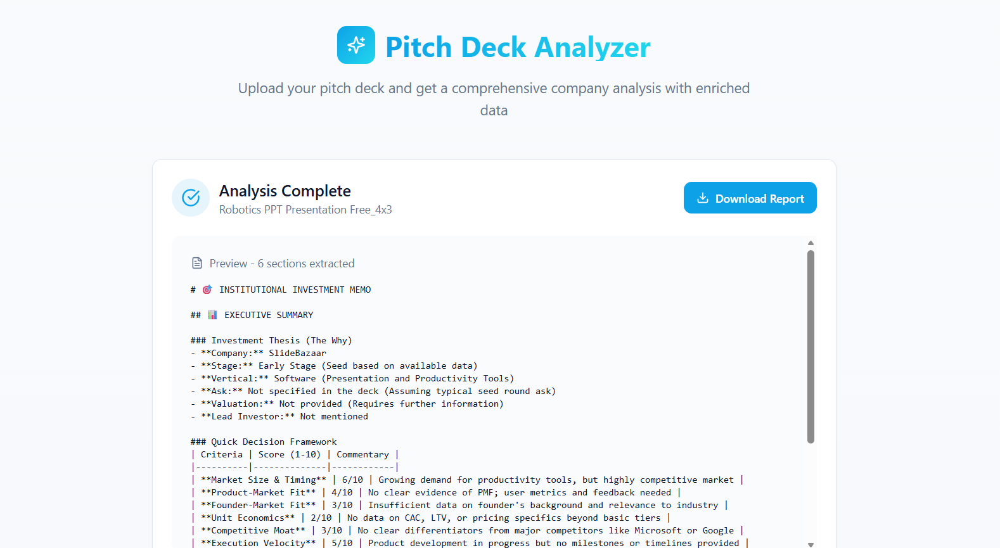
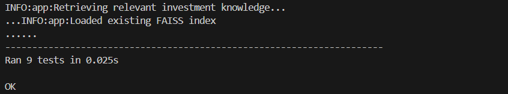
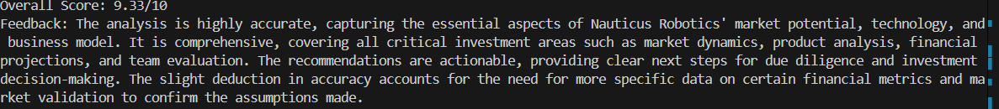

# Pitch Deck Analyzer 🚀
## FullStack app: Backend in Python FrontEnd in TypeScript
A comprehensive AI-powered pitch deck analysis platform that provides institutional-grade investment analysis for venture capital professionals. Built with RAG (Retrieval-Augmented Generation) technology and includes an integrated LLM-as-a-Judge evaluation system for quality assurance.

## 🎯 Overview

The Pitch Deck Analyzer extracts text from pitch decks (PDF/PPTX) and generates detailed investment memos using AI analysis enhanced with specialized investment domain knowledge. The system applies frameworks used by top-tier VC firms and includes quality evaluation to ensure analysis consistency and accuracy.

## 📸 Screenshots

### Main Interface

*Upload your pitch deck with drag-and-drop functionality*

### tests



### Quality Evaluation Results

*LLM-as-a-Judge quality assessment*

## 🏗️ Architecture

### Backend (`/backend`)
- **Python-FastAPI**  endpoints
- **RAG System** powered by FAISS vector database
- **Investment Knowledge Base** with 10+ specialized frameworks
- **Document Processing** for PDF (PyMuPDF) and PPTX (python-pptx) extraction
- **LLM Integration** with OpenAI/OpenRouter APIs
- **LLM-as-a-Judge** evaluation system for analysis quality assessment
- **Configurable Prompts** via JSON configuration

### Frontend (`/frontend`)
- **React 18** with TypeScript and Vite
- **Modern UI** with Tailwind CSS + shadcn/ui components
- **File Upload** with drag-and-drop support (react-dropzone)
- **Real-time Analysis** progress tracking
- **Markdown Preview** and download functionality
- **Responsive Design** with gradient backgrounds and animations


### 🤖 RAG-Enhanced Intelligence
- **Knowledge Base**: 10+ investment topics covering:
  - Startup valuation methods & revenue multiples
  - Market sizing (TAM/SAM/SOM frameworks)
  - Product-market fit indicators & retention analysis
  - SaaS metrics & benchmarks (LTV:CAC, churn rates, NRR)
  - Team assessment & founder-market fit evaluation
  - Competitive analysis & moat evaluation
  - Growth strategy & channel assessment
  - Investment red flags & risk factors

- **FAISS Vector Search**: Semantic similarity matching for relevant investment insights
- **Context-Aware Analysis**: Enriched responses using domain-specific knowledge

### ⚖️ LLM-as-a-Judge Quality Assurance
- **Automated Evaluation**: Secondary LLM evaluates analysis quality across multiple dimensions
- **Quality Scoring**: Multi-dimensional assessment (Accuracy, Completeness, Relevance, Actionability)
- **Consistency Checks**: Ensures analysis follows VC industry standards
- **Improvement Feedback**: Actionable suggestions for enhanced analysis quality

### 📊 Comprehensive Reporting
- **Executive Summary**: Investment thesis, decision framework, risk assessment
- **Deep Dive Analysis**: Market dynamics, product assessment, financial modeling, team evaluation
- **Investment Recommendation**: Decision matrix, suggested terms, risk mitigation strategies
- **Quality Metrics**: Evaluation scores and confidence levels from LLM judge

## 🚀 Quick Start

### Prerequisites
- Python 3.8+
- Node.js 16+
- OpenAI API key or OpenRouter API key

### Backend Setup

```bash
cd backend

# Install Python dependencies
pip install -r requirements.txt

# Set environment variables (optional - can also provide via API)
export OPENAI_API_KEY=your_key_here
# OR
export OPENROUTER_API_KEY=your_key_here

# Start the FastAPI server
python main.py
```

The backend will start on `http://localhost:8000`

### Frontend Setup

```bash
cd frontend

# Install Node.js dependencies
npm install

# Start development server
npm run dev
```

The frontend will start on `http://localhost:5173`

## 📋 Usage

### Web Interface
1. **Upload Pitch Deck**: Drag and drop PDF or PPTX files
2. **API Key** (Optional): Provide OpenAI/OpenRouter API key if not set in backend
3. **Analysis Generation**: Wait for AI-powered analysis with RAG enhancement
4. **Quality Evaluation**: Automatic LLM judge evaluation of analysis quality
5. **Review Report**: Preview comprehensive investment memo with quality scores
6. **Download**: Save markdown report to local machine

### Command Line Interface
```bash
cd backend

# Analyze a pitch deck with evaluation
python app.py path/to/pitchdeck.pdf --api-key YOUR_KEY --evaluate

# Analyze without evaluation
python app.py path/to/pitchdeck.pptx --api-key YOUR_KEY

# Evaluate existing analysis
python test_llm_judge.py path/to/pitchdeck.pdf path/to/analysis.md YOUR_KEY
```

## 🔌 API Endpoints

### Core Analysis
- `POST /analyze/upload` - Upload and analyze pitch deck files
- `POST /analyze/text` - Analyze raw text content
- `GET /health` - System health check with component status
- `GET /` - API status and information

### Knowledge Base
- `GET /knowledge/topics` - List available knowledge base topics
- `POST /knowledge/search` - Search knowledge base directly
- `GET /config/prompts` - Get current prompt configuration

### Example API Usage
```bash
# Upload file analysis
curl -X POST "http://localhost:8000/analyze/upload" \
  -F "file=@pitch_deck.pdf" \
  -F "openai_api_key=your_key_here"

# Text analysis
curl -X POST "http://localhost:8000/analyze/text" \
  -H "Content-Type: application/json" \
  -d '{"content": "Your pitch deck text...", "openai_api_key": "your_key"}'
```

## 🧠 Investment Knowledge Base

The system includes comprehensive investment knowledge covering:

### Valuation & Metrics
- **Revenue Multiples**: 5-15x ARR for SaaS, 2-5x for e-commerce
- **DCF Analysis**: High discount rates (15-25%) for startup risk
- **Comparable Analysis**: Public/private company benchmarks

### Market Analysis
- **TAM/SAM/SOM Framework**: Market sizing methodologies
- **Bottom-up Analysis**: Unit economics × addressable customers × penetration

### Product-Market Fit
- **Sean Ellis Test**: >40% "very disappointed" threshold
- **Retention Analysis**: Cohort flattening indicators
- **Growth Metrics**: Organic growth >20% MoM

### SaaS Benchmarks
- **LTV:CAC Ratio**: >3:1 (excellent >5:1)
- **CAC Payback**: <12 months (best <6 months)
- **Net Revenue Retention**: >110% (best-in-class >130%)

### Team Assessment
- **Founder-Market Fit**: Domain expertise evaluation
- **Execution Track Record**: Milestone achievement analysis
- **Leadership Capability**: Team building and scaling experience

## 🔧 Configuration

### Environment Variables
```bash
# Required (one of the following)
OPENAI_API_KEY=your_openai_key
OPENROUTER_API_KEY=your_openrouter_key

# Optional
API_HOST=0.0.0.0
API_PORT=8000
```

### Prompt Customization
Edit `backend/prompts.json` to customize:
- Analysis frameworks and methodologies
- Scoring criteria and benchmarks
- Output format and structure
- Model parameters (temperature, max_tokens)

### Knowledge Base Extension
Modify `InvestmentKnowledgeBase.get_knowledge_items()` in `backend/app.py` to:
- Add new investment frameworks
- Include additional benchmarks
- Expand domain-specific knowledge
- Update tags for better retrieval

## 🧪 Testing

### Backend Tests
```bash
cd backend
python -m pytest tests/ -v
```

### Run Individual Components
```bash
# Test LLM Judge evaluation
python test_llm_judge.py

# Test RAG system
python -c "from app import FAISSRAGSystem; rag = FAISSRAGSystem(); print(rag.retrieve_knowledge('SaaS metrics'))"
```

## 📁 Project Structure

```
AnalyzePitch/
├── backend/
│   ├── app.py                 # Core RAG system & analysis engine
│   ├── main.py               # FastAPI server & endpoints
│   ├── test_llm_judge.py     # LLM-as-a-Judge evaluation system
│   ├── prompts.json          # LLM prompts & configurations
│   ├── requirements.txt      # Python dependencies
│   ├── tests/
│   │   └── test_app.py      # Unit tests
│   └── faiss_indexes/       # FAISS vector database files
├── frontend/
│   ├── src/
│   │   ├── components/      # React components (FileUpload, AnalysisResult)
│   │   ├── pages/          # Page components (Index, NotFound)
│   │   ├── utils/          # Utility functions (analysisEngine, documentParser)
│   │   └── lib/            # Shared libraries
│   ├── package.json        # Node.js dependencies
│   └── vite.config.ts      # Vite configuration
└── README.md
```

## 🔍 LLM-as-a-Judge Evaluation

### Evaluation Criteria
The system evaluates analysis across multiple dimensions:

- **Accuracy (1-10)**: Correctness of insights and data interpretation
- **Completeness (1-10)**: Coverage of key investment considerations
- **Relevance (1-10)**: Alignment with VC decision-making frameworks
- **Actionability (1-10)**: Quality of recommendations and next steps

### Evaluation Output
```json
{
  "accuracy": 8.5,
  "completeness": 9.0,
  "relevance": 8.8,
  "actionability": 7.5,
  "overall": 8.45,
  "feedback": "Strong analysis with comprehensive market assessment..."
}
```

## 🚀 Deployment

### Backend Deployment
```bash
# Production setup
pip install gunicorn
gunicorn main:app --host 0.0.0.0 --port 8000 --workers 4
```

### Frontend Deployment
```bash
# Build for production
npm run build

# Serve built files
npx serve -s dist -l 3000
```

### Docker Deployment
```dockerfile
# Example Dockerfile for backend
FROM python:3.9-slim
WORKDIR /app
COPY requirements.txt .
RUN pip install -r requirements.txt
COPY . .
EXPOSE 8000
CMD ["uvicorn", "main:app", "--host", "0.0.0.0", "--port", "8000"]
```

## 🤝 Contributing

1. Fork the repository
2. Create a feature branch (`git checkout -b feature/amazing-feature`)
3. Commit your changes (`git commit -m 'Add amazing feature'`)
4. Push to the branch (`git push origin feature/amazing-feature`)
5. Open a Pull Request

### Development Guidelines
- Follow existing code style and patterns
- Add tests for new features
- Update documentation for API changes
- Ensure all tests pass before submitting

## 📚 Technology Stack

### Backend
- **FastAPI**: Modern, fast web framework for APIs
- **FAISS**: Facebook AI Similarity Search for vector operations
- **Sentence Transformers**: For generating embeddings
- **PyMuPDF & python-pptx**: Document processing
- **OpenAI SDK**: LLM integration

### Frontend
- **React 18**: Latest React with hooks
- **TypeScript**: Type-safe development
- **Vite**: Fast build tool and dev server
- **Tailwind CSS**: Utility-first CSS framework
- **shadcn/ui**: Modern React component library
- **React Query**: Data fetching and caching

## 📄 License

This project is licensed under the MIT License - see the [LICENSE](LICENSE) file for details.


